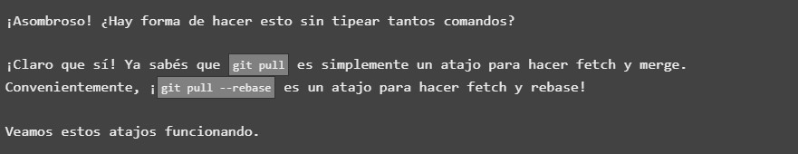

# PESTAÑA PRINCIPAL 
## Push & Pull 7_Trabajo Divergente_

Iniciamos el segundo de los ejercicios asignados, que, como podemos ver, recibe el nombre de _trabajo divergente_. Antes de proceder con su desarrollo, y como de costumbre, realicemos una introducción al ejercicio para ponernos en contexto:

Esta es la ventana inicial con la cual la web comienza la practica:

Como podemos leer, una vez entendidos los conceptos asociados al pull de commits y el pusheo de los mismos, el ejercicio va a orientarnos respecto a que tipo de recursos o herramientas podemos utilizar si en un momento dado el desarrollador o los integrantes que están realizando el proyecto tiene puntos o eventos de desarrollo que pueden dar lugar a conflicto con la linea principal de trabajo.

Pero todo este concepto vemos que estará englobado desde el punto de vista organizativo de repositorios, el cómo podemos gestionarlos para tratar lo menos posible o evitar cambios indeseados de trabajo ya desarrollado.

Aún así, vamos a continuar con esta parte introductoria para ver que nos pretende enseñar la plataforma, si hacemos click al boton de 'siguiente' :

Aqui podemos entender mucho mejor el contexto en el que nos encontramos.

Cuando un desarrollador, partiendo de un repositorio base trabajo, realiza el conjunto de tareas que se le han sido asignados puede ocurrir que, paralelamente, al ser proyectos que generalmente son grupales, exista un equipo que haya modificado, creado o incluso eliminado parte del codigo o trabajo que este desarrollador ha tenido que realizar por ser su tarea trabajo. 

No porque haya hecho mal su trabajo (que puede ser) sino por la mera evolucion temporal del proyecto que, como sabemos, está sujeto día si y día tambien a continuos cambios y actualizaciones por su propio desarrollo mismo.

Todo este conjunto de modificaciones y entregas de proyecto han hecho que el trabajo del desarrollador, por asi decirlo, carezca de validez a nivel de desarollo, ya que, en comparación a los ultimos cambios que se han ido realizando, éste ya ha quedado desactualizado.

¿Como responde GIT ante estas situaciones? Esto es lo que nos pregunta la plataforma.

Fuera de toda duda, lo primero que uno puede percibir es que existirá una gran desorganización a nivel de repositorios entre el trabajo que el desarrollador ha realizado, el que ha sido modificado ajenamente, y hasta incluso el entregado paralelamente, etc...

Como vemos, GIT _NO NOS PERMITIRÍA_ entregar el trabajo que seguramente nos haya costado realizar, sino que nos obligaría a adaptarnos a la situacion mas actual del repositorio que tomamos como base para poder asi, si queremos, integrar el codigo que éste ha desarrollado.

Cualquier persona puede ver que esto sería un nido de conflictos de archivos y código, entre lo que uno ha hecho como parte de su trabajo y lo que se ha realizado paralelamente si no se ha tenido un feedback correcto entre ambas partes.

Aun así, hagamos click en siguiente para ver que más nos tiene que enseñar la web:

¡Pero bueno, si pasamos ya a la acción!

Continuemos pues a ver este concepto en accion:

Si hacemos click al boton siguiente de la anterior imagen, podemos apreciar que nuestro commit, (c3), GIT lo ha rechazado por que, como nuestro commit está vinculado al commit remoto c1, al haberse éste ultimo actualizado (a c2), nuestra entrega es automáticamente rechazada por hacer referencia, como deciamos, a una entrega desactualizada.

Esto tiene muy facil arreglo, y la web nos enseña varias formas de realizarlo a continuación:

## Primera forma

Todo lo que tendríamos que hacer es ponernos a la altura o actualizar nuestro trabajo a la versión mas reciente de la rama remota. Según podemos leer, existen varias maneras, pero como realizaremos el ejercicio será mediante un rebase.

Vamos a mostrar paso a paso este proceso para posteriormente realizar nuestro ejercicio:

Una vez hecho click, la web ejecuta enteramente el proceso, lo desglosaré para así entender cada punto del proceso realizado:

- Como pudimos ver en anteriores imágenes, nuestro proyecto se encontraba en una altura de entrega c3. - Haciendo un _git fetch_ lo que haremos será actualizar nuestro trabajo a la rama de proyecto principal o remota c2
- Con un _rebaseo_ traeremos el trabajo realizado remotamente y así conseguiremos reflejar en nuestro trabajo, todos los cambios que tenia la rama remota.
- Y finalmente, solo nos quedaría hacer un _push_ de nuestro trabajo, ahora así actualizado con respecto a los ultimos cambios realizados remotamente.

## Segunda forma

GIT también nos ofrece una segunda forma de poder entregar nuestro trabajo por si la rama remota no se encuentra en sincronía con el que llevamos realizado.

Y esto lo conseguiremos con el comando _git merge_

Merge o "mezcla" lo que hará será fusionar cualquier tipo de cambio realizado en el codigo base en una rama separada de la rama en la que nos encontramos. Se consideraría como un commit por si mismo.

Basicamente nos serviría para "traer" los cambios realizados en ramas anexas siendo ahora nuestro commit una entrega mas actual que la propia de la rama remota, quedando esta "desactualizada"

Hay que indicar que, si existe algun cambio de la rama en la que nos encontramos al que no se le haya hecho un commit , GIT no permitirá el _merge_ hasta que no se hayan entregado todos los cambios de nuestro trabajo o rama.

Si hacemos click en continuar...

Vemos como se han creado tanto para nuestra rama como para principal respectivas ramas c2 y c3. En primer lugar se crea la rama c2 para así, gracias a un _git fetch_ actualizar nuestro tabajo local a partir del remoto. Una vez actualizado, en la rama remota se crea la nueva rama c3 y finalmente aplicamos un _merge_ para así llevar nuestro trabajo a la rama remota. 

Tan solo nos quedaría realizar un _git push_ para tener todo el proyecto en su ultima version.

Veamos una tercera forma de realizar todo este proceso.

## Tercera forma

Y esta tercera forma será mediante la aplicación, en unas pocas lineas de comandos, de varios métodos que ya conocemos que nos servirá para atajar en gran medida la actualizacion de nuestra rama local. Así es como nos lo presenta la web:

Como podemos leer, aplicaremos en primer lugar un método de rebase:

Para mover una rama (branch) en su totalidad a otro punto del arbol. El ejemplo mas simple suele ser moverse a una rama superior a la linea general de proyecto:

Y posteriormente con un _git pull_, el cual nos servirá para actualizar la version local de nuestro repositorio a partir del remoto.

Con esto conseguiremos:

- Actualizar la rama de trabajo actual (la que acabamos de cambiar)
- Actualizar las referencias de la rama remota para todas las demas ramas.

_git pull_ recuperará (con git fetch) las nuevas confirmaciones y las fusionará (con un _git merge_) en nuestra rama local.

Una vez llegados a este punto, ya hemos visto todos los metodos de gestión de flujos de trabajo, la web nos conduce a la resolución del ejercicio practico propuesto, a si que, vamos con ello:

