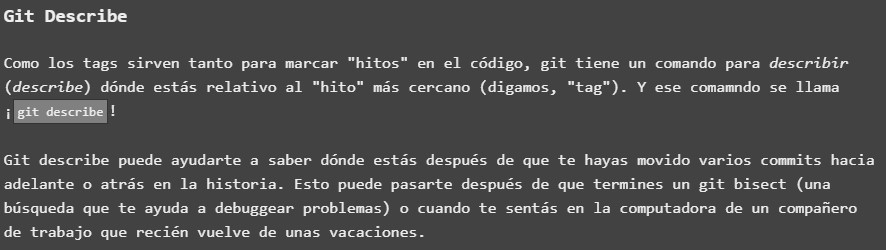
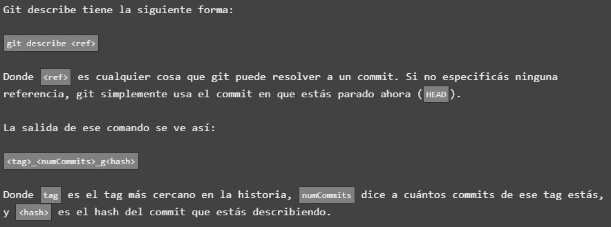
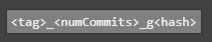

# PESTAÑA PRINCIPAL 
## Un poco de todo_EJERCICIO 5

En este quinto ejercicio, la plataforma tratará de enseñarnos un nuevo comando/concepto conocido como _git describe_

Y uno podrá preguntarse, ¿Qué es Git Describe?, bien, en primer lugar vamos a intentar describirlo con nuestras palabras aunque luego enseñaré cómo trata de explicarnos la plataforma esta nueva utilidad de GIT

## _ENTENDIENDO GIT DESCRIBE_

Partiendo de un proyecto ya comenzado, puede pasar que nos sintamos perdidos en relación a la evolución del mismo, o tratar de recordar cada uno de los cambios que se han ido realizando a medida que ha ido avanzando el proyecto.

Como recordaremos, cada vez que exista un punto evolutivo en el proyecto que nos interesa remarcar, haremos uso de lo que conocemos como **tags**, gracias a esto, podremos situarnos rapidamente en aquellos cambios importantes que se han ido marcando a lo largo del mismo.

Pues bien, GIT, a partir de un **hito** determinado, con el comando >git describe< nos proporcionará información para saber en que punto del proyecto estamos y asi nos resulte mucho mas facil "situarnos". **Esto es especialmente util cuando nos hemos ido moviendo entre distintas entregas (commits)**. 

Pero no nos extendamos mucho mas, a continuación muestro cómo trata de enseñarnos la plataforma este concepto, y comenzaremos a realizar el ejercicio propuesto:

## EJECUCION DE COMANDO _GIT DESCRIBE_

Una vez tenemos una idea aproximada sobre en qué consiste el comando _git describe_ tendremos que saber como usarlo correctamente en nuestro terminal GIT. En esta ocasión, vamos a mostrar como nos lo enseña la platarforma y posteriormente trataremos de razonar su funcionamiento:

Como podemos enteder, para poder hacer uso de este comando, necesitaremos proporcionarle como parámetro una **<ref>**  o referencia que el que tomará GIT como punto de destino para situarnos en ese **tag** de proyecto. Nos informa la web que si no le proporcionamos ninguna referencia como parámetro, GIT automaticamente nos situará en el commit mas cercano.

Una vez resuelto el comando con referencia dada, la salida por consola mostrará la siguiente información:

Donde **numCommits** será la cantidad de entregas que se han realizado **a partir del tag** en el cual nos hemos situado y **hash** está haciendo referencia al commit que en ese momento esta siendo indicado.