# PESTAÑA PRINCIPAL 
## Un poco de todo_EJERCICIO 5

En este quinto ejercicio, la plataforma tratará de enseñarnos un nuevo comando/concepto conocido como _git describe_

Y uno podrá preguntarse, ¿Qué es Git Describe?, bien, en primer lugar vamos a intentar describirlo con nuestras palabras aunque luego enseñaré cómo trata de explicarnos la plataforma esta nueva utilidad de GIT

## _ENTENDIENDO GIT DESCRIBE_

Partiendo de un proyecto ya comenzado, puede pasar que nos sintamos perdidos o no sepamos en que punto de desarrollo exacto se encuentra el proyecto, o también, por que no, saber cada uno de los cambios que se han ido realizando a a lo largo de su vida útil.

Como recordaremos, cada vez que exista un punto evolutivo a lo largo de la historia del proyecto que nos interesa remarcar de forma permanente, haremos uso de lo que conocemos como **tags**, gracias a esto, podremos situarnos rapidamente en aquellos cambios importantes que se han ido marcando a lo largo del mismo.

Pues bien, GIT, a partir de un **hito** (tag) determinado, con el comando >git describe< nos proporcionará información para saber en que punto del proyecto estamos y asi nos resulte mucho mas facil "situarnos". **Esto es especialmente util cuando nos hemos ido moviendo entre distintas entregas (commits)**. 

Pero no nos extendamos mucho mas, a continuación muestro cómo trata de enseñarnos la plataforma este concepto, y comenzaremos a realizar el ejercicio propuesto:

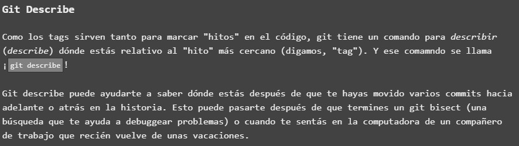

## EJECUCION DE COMANDO _GIT DESCRIBE_

Una vez tenemos una idea aproximada sobre en qué consiste el comando _git describe_, tendremos que saber como usarlo correctamente en nuestro terminal GIT. En esta ocasión, vamos a mostrar como nos lo enseña la plataforma y posteriormente trataremos de razonar su funcionamiento:

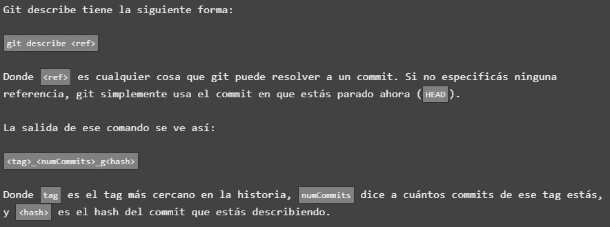

Como podemos enteder, para poder hacer uso de este comando, necesitaremos proporcionarle como parámetro una **<ref>** o referencia que es el que tomará GIT como punto de destino para situarnos en ese **tag** de proyecto. Nos informa la web que si no le proporcionamos ninguna referencia como parámetro, GIT automaticamente nos situará en el commit mas cercano.

Una vez resuelto el comando con referencia dada, la salida por consola mostrará la siguiente información:

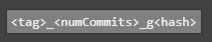

Donde **numCommits** será la cantidad de entregas que se han realizado **a partir del tag** en el cual nos hemos situado y el **hash** (una especie de "firma" hexadecimal abreviado) que está haciendo referencia al commit respectivo.

# ENTENDIENDO EJEMPLO PRÁCTICO 

Una vez hemos hecho la introducción teórica a este nuevo comando GIT, he decidido mostrar, antes de proceder a resolver el ejercicio propuesto, un ejemplo práctico que nos propone la plataforma, y es el siguiente:

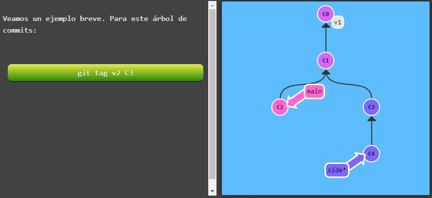

Vemos como, para la evolución de proyecto mostrada, estamos en la branch side (por su asterisco). A continuación el programa nos muestra la salida por consola tanto si aplicamos **git describe** a **main** o a **side**:

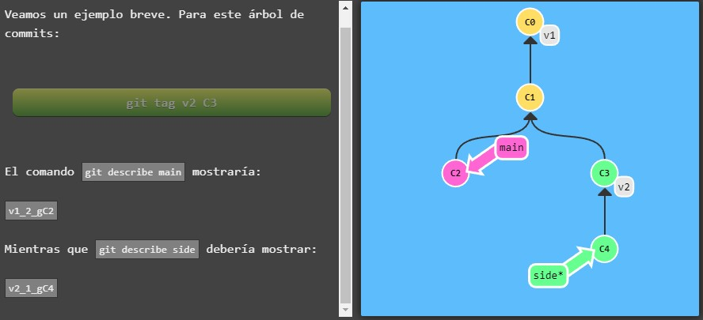

Y aqui podemos ver claramente el funcionamiento de este comando:

### main

Si escribimos por consola **git describe main** estaríamos situándonos en el ultimo commit de la rama master obteniendo el siguiente resultado: **v1_2_gC2**

¿Que significa cada valor?:

- v1: para main, v1 sería el **tag** o evento o "hito" mas cercano. Es por ello por lo que lo toma como referencia.
- 2: valor numérico 2, serían la cantidad de commits o "entregas" que existen a partir del tag de referencia v1.
- gC2: para el commit C2 de main, su hash representativo.

### side

¿Y para la rama creada side? Vemos que obtenemos como resultado **v2_1_gC4**. Aplicando el razonamiento anterior, averigüemos que significa cada valor:

- v2: como podemos ver, basandonos en el diagrama, v2 sería el **tag** de referencia.
- 1: valor numerico 1, esto es el numero de entregas existentes desde el tag v2 hasta donde estamos c4 (side asterisco). Como podemos ver, una unica entrega, el commit C4 que se ha realizado.
- gc4: el hash del commit indicado, es decir el commit 4 de la rama side.

Y una vez mostrada esta pequeña introducción práctica, la web nos conduce a la resolución del ejercicio:

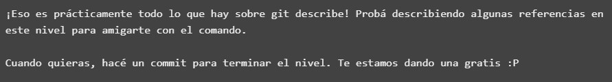

# RESOLVIENDO EJERCICIO

- Comienzo el ejercicio propuesto partiendo desde la siguiente situación:

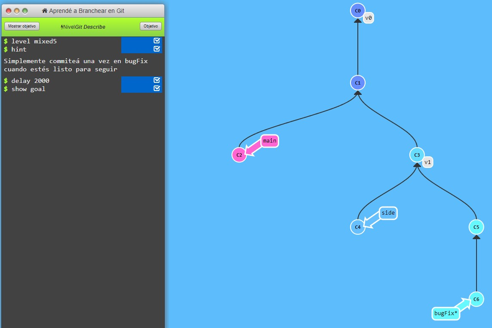

Tal y como nos indica el cuadro de comandos, tendremos que hacer un commit de bugFix para finalizar el ejercicio, por ello escribimos **git commit**, para hacer una entrega del mismo:

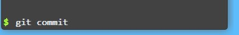

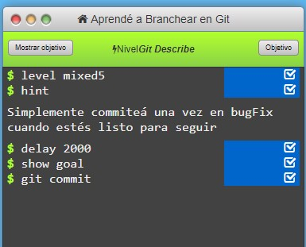

Y sencillamente con este paso, la web nos indica que hemos resuelto el ejercicio exitosamente:

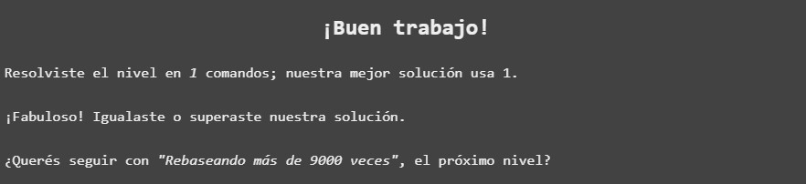

Pero no nos quedemos aqui, para poder ver como aplicamos el comando que acabamos de aprender, voy a escribir por linea de comando un ejemplo para **git describe c7**. Obtenemos el siguiente resultado:

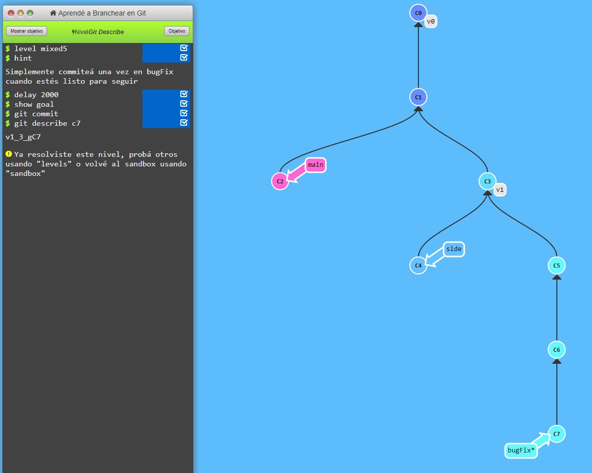

Obtenemos **v1_3_gC7**

- v1: como podemos ver en el diagrama, para la rama bugFix, v1 sería el hito que ésta toma como referencia
- 3: valor numérico 3, que sería el número de commits desde el tag v1 hasta el punto en el que nos encontramos (c7), que como podemos contar serían 3.
- gC7: el hash del commit donde actualmente nos escontramos.

Con esto, hemos visto como el comando _git describe_ puede sernos muy util para saber un punto importante de la rama o proyecto, sobre todo para saber puntos clave en el desarrollo de éste o desde que punto podríamos continuar nuestro trabajo. 

Un recurso, sin duda, a tener muy en cuenta.